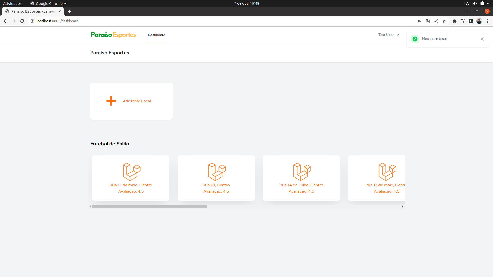

Instalação do Projeto Laravel com Inertia e Vue.js
Bem-vindo ao projeto incrível que você está prestes a configurar! Aqui estão as etapas para instalação e configuração do ambiente:

Pré-requisitos
Certifique-se de que você tenha os seguintes requisitos instalados em sua máquina:

PHP >= 7.4
Composer
Node.js >= 14
NPM ou Yarn
Banco de dados MySQL
Passo 1: Clonar o repositório
Clone o repositório do projeto para sua máquina local:

bash
Copy code
git clone https://github.com/seu-usuario/seu-projeto.git
Passo 2: Instalar as dependências
Vá para o diretório do projeto e instale as dependências do Composer e do NPM:

bash
Copy code
cd seu-projeto
composer install
npm install
Passo 3: Configurar o ambiente
Copie o arquivo .env.example para .env e configure suas variáveis de ambiente, incluindo as configurações do banco de dados.

bash
Copy code
cp .env.example .env
Em seguida, gere a chave de aplicativo:

bash
Copy code
php artisan key:generate
Passo 4: Migrar e popular o banco de dados
Execute as migrações para criar as tabelas do banco de dados:

bash
Copy code
php artisan migrate
Se desejar, você pode preencher o banco de dados com dados de exemplo:

bash
Copy code
php artisan db:seed
Passo 5: Compilar os assets
Compile os assets do Vue.js usando o Mix:

bash
Copy code
npm run dev
Passo 6: Iniciar o servidor local
Inicie o servidor de desenvolvimento:

bash
Copy code
php artisan serve
Acesse o aplicativo em http://localhost:8000 no seu navegador.
